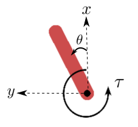

Pendulum-v1
---
|Title|Action Type|Action Shape|Action Values|Observation Type| Observation Shape|Observation Values|Average Total Reward|Import|
| ----------- | -----------| ----------- | -----------|-----------| ----------- | -----------| ----------- | -----------|
|Pendulum-v1|Box|(1,)|(-2.0,2.0)| Box |(3,)|[(-1.0,1.0), (-1.0,1.0), (-8.0,8.0)]||`from gym.envs.classic_control.pendulum import PendulumEnv`|
---

### Description

The inverted pendulum swingup problem is a classic problem in the control literature. In this
version of the problem, the pendulum starts in a random position, and the goal is to swing it up so
it stays upright.

The diagram below specifies the coordinate system used for the implementation of the pendulum's
dynamic equations.



- `x-y`: cartesian coordinates of the pendulum's end in meters.
- `theta`: angle in radians.
- `tau`: torque in `N * m`. Defined as positive _counter-clockwise_.

### Action Space
The action is the torque applied to the pendulum. 
| Num | Action | Min  | Max |
|-----|--------|------|-----|
| 0   | Torque | -2.0 | 2.0 |


### Observation Space
The observations correspond to the x-y coordinate of the pendulum's end, and its angular velocity.

| Num | Observation      | Min  | Max |
|-----|------------------|------|-----|
| 0   | x = cos(theta)   | -1.0 | 1.0 |
| 1   | y = sin(angle)   | -1.0 | 1.0 |
| 2   | Angular Velocity | -8.0 | 8.0 |

### Rewards
The reward is defined as:
```
r = -(theta^2 + 0.1*theta_dt^2 + 0.001*torque^2)
```
where `theta` is the pendulum's angle normalized between `[-pi, pi]`.
Based on the above equation, the minimum reward that can be obtained is `-(pi^2 + 0.1*8^2 +
0.001*2^2) = -16.2736044`, while the maximum reward is zero (pendulum is
upright with zero velocity and no torque being applied).

### Starting State
The starting state is a random angle in `[-pi, pi]` and a random angular velocity in `[-1,1]`.

### Episode Termination
An episode terminates after 200 steps. There's no other criteria for termination.

### Arguments
- `g`: acceleration of gravity measured in `(m/s^2)` used to calculate the pendulum dynamics. The default is
  `g=10.0`.

```
gym.make('CartPole-v1', g=9.81)
```

### Version History

* v1: Simplify the math equations, no difference in behavior.
* v0: Initial versions release (1.0.0)
